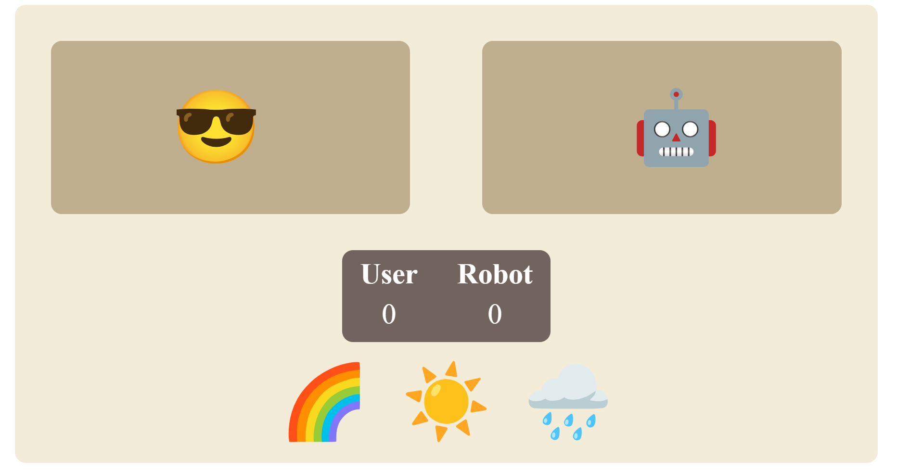

# EmojiBattle

**EmojiBattle** is a fun and interactive web-based game where players use different emojis to battle against each other. The game logic is implemented in JavaScript, and the project includes a clean, responsive layout styled with CSS.

## Features

- **Emoji-based battles**: Players can choose different emojis to engage in battle.
- **Interactive gameplay**: Real-time interaction using JavaScript to manage the game state.
- **Responsive design**: Styled with CSS to look great on any device.

## Demo 
Download emojibattle-demo.zip to watch the project in action!

[]

## File Structure

- **`index.html`**: This file contains the HTML structure of the game interface.
- **`emoji.css`**: This file contains the CSS for styling the layout and game elements.
- **`emoji.js`**: This file contains the JavaScript that controls the game logic and interactivity.
